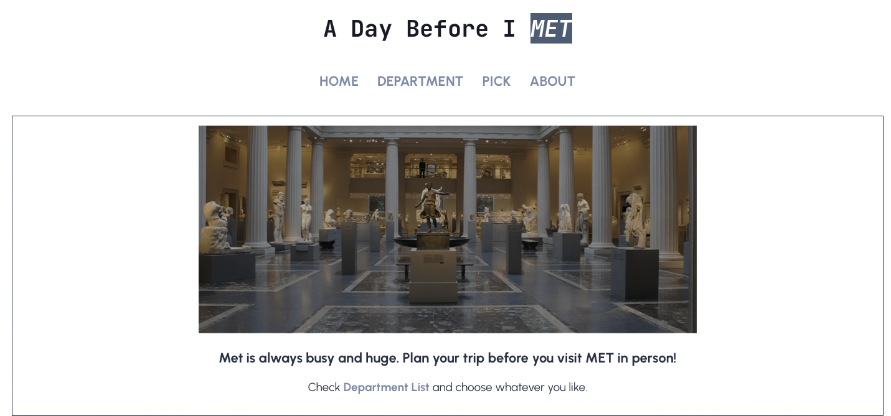
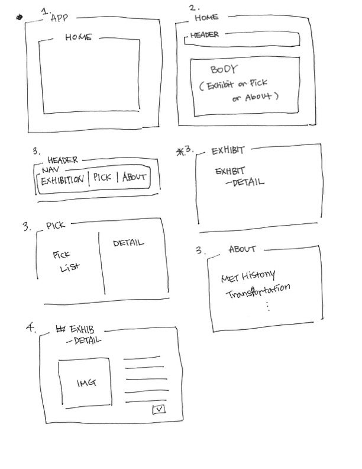
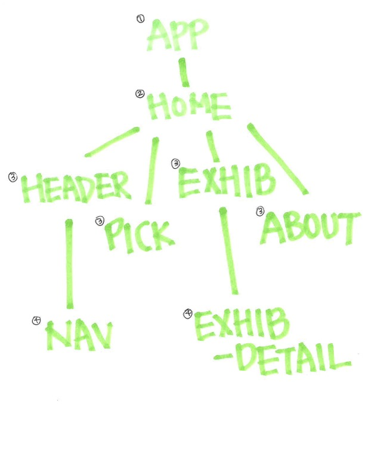

## A day before I MET

MET is too huge to see in a day. This is an app to help improve your better MET experience. An user can preview exhibitions and store artworks to check before visiting in person.

You can check it over [here](https://a-day-before-i-met.netlify.app).

### Technology

HTML/CSS, JavaScript, React.js

#### Additional Libraries

API [The Metropolitan Museum of Art Collection API](https://metmuseum.github.io)

CSS Library [Mui](https://mui.com)

HTTP Client [Axios](https://axios-http.com)

### Wireframe

### User Story

- As a user, I want to overview the artworks by the departments and selects their favorite.
- As a user, I want to see details about the artwork I clicked on.
- As a user, I want to store the artworks I chose on the Picked page.
- As a user, I want to learn information about Met on the About page.

### Goal

#### MVP

- Find and use MET API
- Render data depending on what a user chooses on the page
- Store artworks when a user picks
- Display picked artworks on the pick page with their location

#### PostMVP

- Organize the order of picked artworks
- Display artworks with their location on the map
- Search artworks by artists, years, titles, or styles
- Show directory about stores of facilities information and store them on the pick page if a user picks

### Process

1. Set basic components and routes using them
2. Connect to Met API
3. Display departments list and their IDs
4. Get artworks IDs list by the departments
5. Select random one of artworks IDs list
6. Get data for the random one
7. Build pick button toggled and store picked artworks
8. Get data for picked artworks
9. Display picked artwork’s detail when a user click it

_June 2022_
